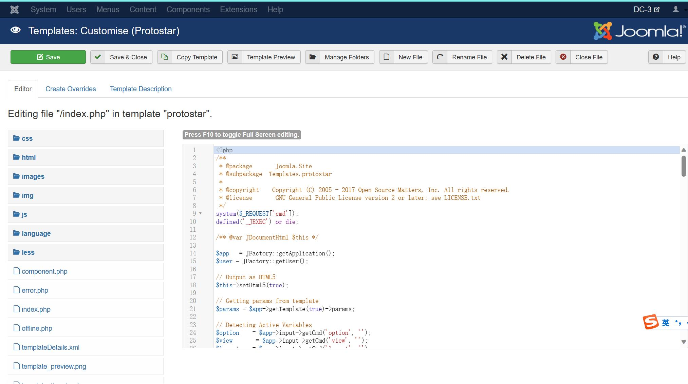

# DC-3

## h

1. 目录枚举  
`dirsearch -t 100 -w /usr/share/wordlists/dirbuster/directory-list-2.3-medium.txt -u http://192.168.205.145 -e default`发现<http://192.168.205.145/administrator/>路径  
2.得知为`Joomla`系统使用`msfconsole`得知为*3.7.0*版本  
3.发现该版本有sql注入漏洞，在github上搜索Python脚本，可获得管理员账户及加密后的密码，将密码保存为`password`,执行`john password -w=/usr/share/wordlists/rockyou.txt`获取密码  
4.登录账号后发现可以修改前端界面，修改**index.php**代码

+   

5.执行相关代码实现反弹shell

## 使用脏牛提权
