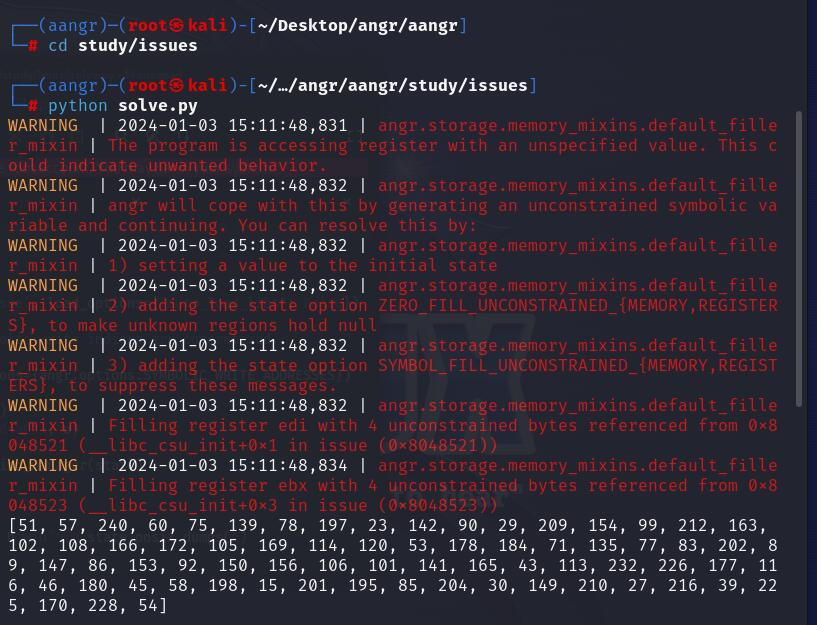

# 本周学习内容

## 1 更加深入了解了栈溢出漏洞相关知识  

>学习了**canary_pie绕过**，可以编写相关的exp进行相关题目的作答  
>学习了**libcsearcher**,可以在程序中查询libc函数偏移，然后再次获取 system 地址，进而解答一些基本的相关题目  
>开始学习64位程序的栈溢出利用，可以执行一些基础的ret2csu题目作答  
>了解了一些格式化字符串的内容，可以实现基本的利用  

## 2 学习了一些基本的自动化利用工具

### afl的使用

#### 插桩  


#### 输入以下代码以进行模糊测试  

`afl-fuzz -i in -o out test`  


#### 使用gdb进行分析

输入以下代码：

```bash
   gdb test //test为二进制文件
   run < crash  //crash为得出的crashes
```


  
有图片可知，程序崩溃原因为***SIGSEGV***  

### 符号执行

对简单的程序进行分析

```C
#include <stdio.h>

char u=0;
int main(void)
{
 int i, bits[2]={0,0};
 for (i=0; i<8; i++) {
  bits[(u&(1<<i))!=0]++;
 }
 if (bits[0]==bits[1]) {
  printf("you win!");
 }
 else {
  printf("you lose!");
 }
 return 0;
}
```

简单的solve.py  

```python
import angr
import claripy

def main():
 p = angr.Project('./issue', load_options={"auto_load_libs": False})  #load_options={"auto_load_libs": False}表示不自动加载库文件

 state = p.factory.entry_state(add_options={angr.options.SYMBOLIC_WRITE_ADDRESSES})  #add_options={angr.options.SYMBOLIC_WRITE_ADDRESSES}表示允许符号化写地址。


 u = claripy.BVS("u", 8)     #创建一个符号变量u，并将其存储在内存地址0x804a021
 state.memory.store(0x804a021, u)  


 sm = p.factory.simulation_manager(state)  #创建一个模拟管理器sm，用于管理符号执行的状态

 def correct(state):
  try:
   return b'win' in state.posix.dumps(1)
  except:
   return False
 def wrong(state):
  try:
   return b'lose' in state.posix.dumps(1)
  except:
   return False

 sm.explore(find=correct, avoid=wrong)  #使用sm.explore方法来探索所有可能的执行路径，寻找满足correct函数条件的状态，同时避免满足wrong函数条件的状态

 # Alternatively, you can hardcode the addresses.
 # sm.explore(find=0x80484e3, avoid=0x80484f5)

 return sm.found[0].solver.eval_upto(u, 256)


def test():
 good = set()
 for u in range(256):
  bits = [0, 0]
  for i in range(8):
   bits[u&(1<<i)!=0] += 1
  if bits[0] == bits[1]:
   good.add(u)

 res = main()
 assert set(res) == good

if __name__ == '__main__':
 print(repr(main()))
```

运行得：

