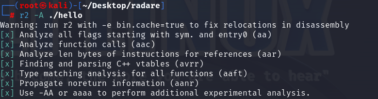
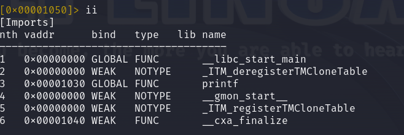
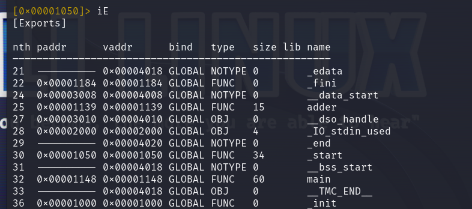
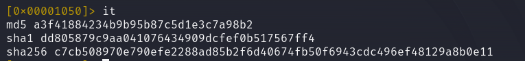
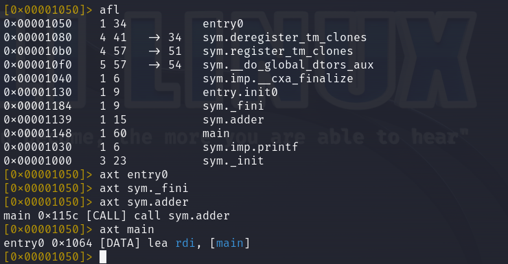
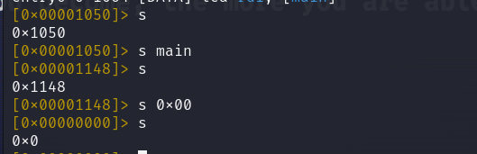
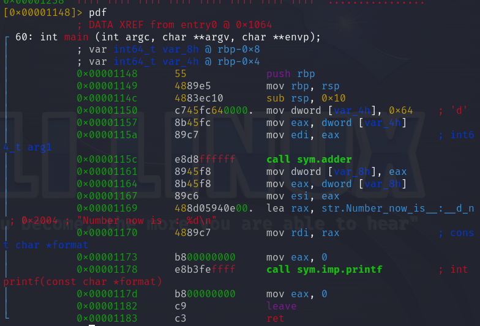

# redare使用

## redare常用指令

```bash
$ cat adder.c
#include <stdio.h>

int adder(int num) {
        return num + 1;
}

int main() {
        int res, num1 = 100;
        res = adder(num1);
        printf("Number now is  : %d\n", res);
        return 0;
}
$ gcc adder.c -o adder
$ file adder
adder: ELF 64-bit LSB executable, x86-64, version 1 (SYSV), dynamically linked, interpreter /lib64/ld-linux-x86-64.so.2, for GNU/Linux 3.2.0, BuildID[sha1]=9d4366f7160e1ffb46b14466e8e0d70f10de2240, not stripped
$ ./adder
Number now is  : 101
```

1. `r2 -A ./adder`打开控制台进行文件初步分析  

2. `iI` 获取二进制文件基本信息，比如是二进制文件的格式（ELF、PE 等）、二进制的架构（x86、AMD、ARM 等），以及二进制是 32 位还是 64 位。  
3. `ii`显示了该二进制所有导入的库  

4. `iE`显示二进制文件基本信息，如基本数据，函数，符号等  
  
5. `it`使用 it 命令找到二进制的哈希值  

6. `afl`列出二进制中存在的函数  
7. `axt`判断函数的调用位置  

8. `s`移动我们在二进制文件的地址`px`展示相应位置的十六进制模式下查看二进制及其等效的 ASCII 表示法

9. `pdf`查看反汇编  


## IDA

之前在进行pwn题目的研究时已经学习了IDA的基本用法，在此粘出快捷指令  

```test
空格键：反汇编窗口切换文本跟图形

ALT+T：搜索字符串(文本搜索)

a：将数据转换为字符串

f5：一键反汇编

esc：回退键，能够倒回上一部操作的视图（只有在反汇编窗口才是这个作用，如果是在其他窗口按下esc，会关闭该窗口）

shift+f12：可以打开string窗口，一键找出所有的字符串，右击setup，还能对窗口的属性进行设置

ctrl+w：保存ida数据库

ctrl+s：选择某个数据段，直接进行跳转

ctrl+鼠标滚轮：能够调节流程视图的大小

x：对着某个函数、变量按该快捷键，可以查看它的交叉引用

g：直接跳转到某个地址

n：更改变量的名称

y：更改变量的类型

/ ：在反编译后伪代码的界面中写下注释

\：在反编译后伪代码的界面中隐藏/显示变量和函数的类型描述，有时候变量特别多的时候隐藏掉类型描述看起来会轻松很多

；：在反汇编后的界面中写下注释

ctrl+shift+w：拍摄IDA快照

u：undefine，取消定义函数、代码、数据的定义
```
